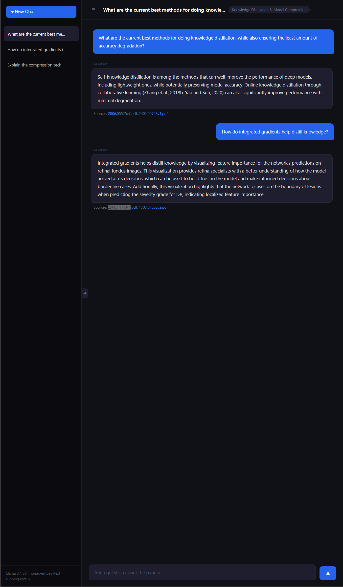

# ML Papers RAG Assistant

A fully local Retrieval-Augmented Generation (RAG) system for querying a corpus of ML research papers on knowledge distillation and model compression. Built with FastAPI, LlamaIndex, ChromaDB, and Llama 3.1 8B — no API keys, no cloud costs, everything runs on your own hardware.



---

## What it does

Instead of asking a general-purpose LLM questions from memory, this system retrieves relevant chunks from 31 actual research papers before generating an answer. Every response is grounded in the source literature and cites which papers it drew from — making answers verifiable and reducing hallucination.

This is the core idea behind RAG: **retrieve first, then generate**.

---

## Architecture
```
User question
      │
      ▼
nomic-embed-text          ← converts question to a vector
      │
      ▼
ChromaDB similarity search ← finds the 3 most relevant chunks across 31 papers
      │
      ▼
Llama 3.1 8B (via Ollama)  ← generates an answer grounded in those chunks
      │
      ▼
FastAPI → SQLite           ← serves response, saves to chat history
      │
      ▼
Browser UI                 ← displays answer + source paper filenames
```

Two separate models are involved on every query:
- **nomic-embed-text** — a small, fast embedding model. Converts text to vectors for semantic search.
- **Llama 3.1 8B Q4** — the generation model. Takes the retrieved chunks + question and writes the answer.

---

## Tech stack

| Layer | Tool | Purpose |
|---|---|---|
| LLM + Embeddings | Ollama | Local model serving, no API key needed |
| Generation model | Llama 3.1 8B (Q4 quantized) | Answer generation |
| Embedding model | nomic-embed-text | Semantic search |
| RAG framework | LlamaIndex | Document ingestion, chunking, retrieval |
| Vector database | ChromaDB | Persistent storage of embedded chunks |
| Backend | FastAPI | REST API, chat management |
| Database | SQLite | Persistent chat and message history |
| Frontend | Vanilla HTML/CSS/JS | Chat UI with sidebar, no framework needed |

---

## Features

- **Fully local** — runs entirely on your machine, no external API calls
- **Persistent chat history** — conversations saved to SQLite, survive server restarts
- **Multi-chat support** — create, switch between, and delete chats
- **Source attribution** — every answer shows which papers it was retrieved from
- **Auto-titling** — chats are automatically named after the first question
- **Collapsible sidebar** — toggle via header button or sidebar edge

---

## Requirements

- [Ollama](https://ollama.com) installed and running
- Python 3.10+
- [uv](https://github.com/astral-sh/uv) (recommended) or pip
- NVIDIA GPU with 8GB+ VRAM recommended (tested on RTX 3060 Ti)
- ~6GB disk space for models

---

## Setup

**1. Clone the repo**
```bash
git clone https://github.com/davidhndezmchdo/ml-rag-assistant.git
cd ml-rag-assistant
```

**2. Pull the required models**
```bash
ollama pull llama3.1:8b
ollama pull nomic-embed-text
```

**3. Install dependencies**
```bash
uv venv
source .venv/bin/activate  # Windows: .venv\Scripts\activate
uv sync
```

**4. Add your documents**

Place PDF files in the `docs/` folder. The included corpus covers knowledge distillation and model compression — swap in any PDFs relevant to your domain.

**5. Build the vector index**
```bash
python ingest.py
```

This chunks and embeds all PDFs into ChromaDB. Only needs to run once, or again when you add new documents.

**6. Start the server**
```bash
uvicorn main:app --reload
```

Visit `http://localhost:8000`

---

## API endpoints

| Method | Endpoint | Description |
|---|---|---|
| `GET` | `/chats` | List all chats |
| `POST` | `/chats` | Create a new chat |
| `DELETE` | `/chats/{id}` | Delete a chat and its messages |
| `GET` | `/chats/{id}/messages` | Load message history for a chat |
| `POST` | `/chats/{id}/query` | Send a question, get a RAG response |
| `GET` | `/health` | Health check |

Interactive API docs available at `http://localhost:8000/docs`

---

## Design decisions

**Why ChromaDB over Pinecone or Weaviate?**
Pinecone and Weaviate are cloud services that require API keys and have usage costs. ChromaDB runs locally and persists to disk — ideal for a self-hosted project. In a production system with scale requirements, swapping ChromaDB for Pinecone would be straightforward since LlamaIndex abstracts the vector store interface.

**Why LlamaIndex over LangChain?**
LlamaIndex is purpose-built for document Q&A and RAG workflows. Its abstractions around document loading, chunking, and retrieval are cleaner for this use case than LangChain, which is more general-purpose.

**Why SQLite over PostgreSQL?**
SQLite requires zero configuration and runs in-process. For a single-user local application this is the right tradeoff. Migrating to PostgreSQL for a multi-user deployment would require minimal code changes thanks to the database abstraction layer in `database.py`.

**Why vanilla JS over React?**
The frontend has no build step, no dependencies, and loads instantly. For a single-page chat interface the complexity of a framework isn't justified. The entire UI is one file that anyone can read and understand immediately.

**Context window tuning**
Llama 3.1 8B defaults to a 128k token context window, which exceeds available VRAM on an 8GB GPU when combined with retrieved chunks. Setting `context_window=2048` and `similarity_top_k=3` keeps memory usage within bounds while retaining answer quality.

---

## Project structure
```
ml-rag-assistant/
├── main.py          # FastAPI app, RAG query endpoint, chat endpoints
├── database.py      # SQLite operations (chats + messages)
├── ingest.py        # One-time PDF ingestion and ChromaDB index building
├── static/
│   └── index.html   # Frontend chat UI
├── docs/            # PDF corpus (not tracked in git)
├── chroma_db/       # Vector store (not tracked in git, built by ingest.py)
├── screenshots/
│   └── chat.png
└── pyproject.toml
```

---

## Related work

This project is built around my own research on knowledge distillation and model compression:

- **Knowledge Distillation: Enhancing Neural Network Compression with Integrated Gradients** — accepted at MadeAI. [arXiv:2503.13008](https://arxiv.org/abs/2503.13008)
- **Model Compression Using Knowledge Distillation with Integrated Gradients** — journal manuscript under review. [arXiv:2506.14440](https://arxiv.org/abs/2506.14440)
